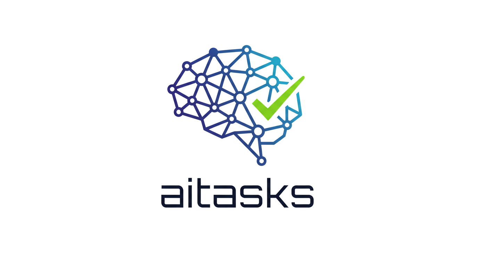

<div align="center">
  <picture>
    <source media="(prefers-color-scheme: dark)" srcset="imgs/aitasks_logo_dark_theme_im.png">
    <source media="(prefers-color-scheme: light)" srcset="imgs/aitasks_logo_light_theme_pil.png">
    
  </picture>

  <h3><em>File-based task management for AI coding agents. No backend. Just markdown and git.</em></h3>

  <p>
    <a href="https://beyondeye.github.io/aitasks/"></a>
    <a href="https://github.com/beyondeye/aitasks/stargazers"></a>
<a href="https://github.com/beyondeye/aitasks/commits/main"></a>
    <a href="https://github.com/beyondeye/aitasks/issues"></a>
  </p>
</div>

---

A file-based task management system that integrates with [Claude Code](https://docs.anthropic.com/en/docs/claude-code) via skills. Tasks are markdown files with YAML frontmatter, organized in a kanban-style workflow. Includes a Python TUI board, GitHub issue integration, and completion statistics.

Built for maximizing development speed 🚀 AND human-to-agent intent transfer efficiency 💬.

Inspired by [Conductor](https://github.com/gemini-cli-extensions/conductor), and [beads](https://github.com/steveyegge/beads)

## 🎯 The Challenge
AI coding agents has reached a proficiency level where, given correct specs and intent, are almost always capable of handling a code-development task. The challenge is the transfer of intent from developer/designer to the AI agent. The challenge is two-fold:
  1) Transfer intent in a structured way that optimize context building for the AI agent
  2) Maximize speed so that the human in the loop does not become the bottle-neck for development speed

## 💡 Core Philosophy
"Light Spec" engine: Unlike rigid Spec-Driven Development (e.g., [Speckit](https://github.com/github/spec-kit), tasks here are living documents:
  - Raw Intent: A task starts as a simple Markdown file capturing the goal.
  - Iterative Refinement: An included AI workflow refines task files in stages—expanding context, adding technical details, and verifying requirements—before code is written.

## 🏗️ Key Features & Architecture
- Repository-Centric (Inspired by Conductor)
  - Tasks as Files: Every task is a Markdown file stored within the code repository.

  - Self-Contained Metadata: Unlike Conductor, task metadata (status, priority, assignee) is stored directly in the file's YAML frontmatter.

- Daemon-less & Stateless (The Beads Evolution) No Infrastructure: No SQL backend, no background daemons. Just files and scripts.

- Remote-Ready: Because the state is entirely in the file system, it works seamlessly in remote AI-agent sessions.

- Dual-Mode CLI tools optimized for two distinct users:
  - Interactive Mode (For Humans): Optimized for "Flow." Rapidly create, edit, and prioritize tasks without context switching.
  - Batch Mode (For Agents): allowing AI agents to read specs, create tasks and update task status programmatically.

- Hierarchical Execution
  - Task Dependencies: Define task/task and task parent/task child relationships.

  - Agent Decomposition: If a task is too risky or complex for a single run, the Agent can "explode" a parent task into child files.

  - Parallelism: thanks to task status stored in git, and AI agents workflow that support git worktrees.

- Visual Management
TUI Board: A terminal-based visual interface (Kanban style) for visualizing and organizing tasks without leaving the terminal. See the [Board Documentation](https://beyondeye.github.io/aitasks/docs/board/) for full details.

- Battle tested:
Not a research experiment. actively developed and used in real projects

- Claude Code optimized.

- Fully customizable workflow for each project:  all the scripts and workflow skills live in you project repo: modify it for your needs. You will still be able to merge new features and cabilities as they are added to the framework, with the included AI agent-based framework update skill.

## 🖥️ Platform Support

| Platform | Status | Notes |
|----------|--------|-------|
| Arch Linux | Fully supported | Primary development platform |
| Ubuntu/Debian | Fully supported | Includes Pop!_OS, Linux Mint, Elementary |
| Fedora/RHEL | Fully supported | Includes CentOS, Rocky, Alma |
| macOS | Fully supported | Requires Homebrew for bash 5 and coreutils (auto-installed by `ait setup`) |
| Windows (WSL) | Fully supported | Via WSL with Ubuntu/Debian (see [Windows guide](https://beyondeye.github.io/aitasks/docs/installation/windows-wsl/)) |

## ⚡ Quick Install

Install into your project directory:

```bash
curl -fsSL https://raw.githubusercontent.com/beyondeye/aitasks/main/install.sh | bash
ait setup
```

> **Windows users:** Run this inside a WSL shell, not PowerShell. See the [Windows/WSL guide](https://beyondeye.github.io/aitasks/docs/installation/windows-wsl/).

`ait setup` installs dependencies and configures Claude Code permissions. See [`ait setup`](https://beyondeye.github.io/aitasks/docs/commands/setup-install/) for details.

Upgrade an existing installation:

```bash
ait install latest
ait setup
```

Or for fresh installs without an existing `ait` dispatcher:

```bash
curl -fsSL https://raw.githubusercontent.com/beyondeye/aitasks/main/install.sh | bash -s -- --force
ait setup
```

**Already have the global `ait` shim?** If you've previously run `ait setup` on another project, the global shim at `~/.local/bin/ait` is already installed. You can bootstrap aitasks in any new project directory by simply running:

```bash
cd /path/to/new-project
ait setup
```

The shim detects that no aitasks project exists, downloads the latest release, installs it, and then runs the full setup — all in one command.

**Windows/WSL users:** See the [Windows/WSL Installation Guide](https://beyondeye.github.io/aitasks/docs/installation/windows-wsl/) for step-by-step instructions including WSL setup, Claude Code installation, and terminal configuration.

## 📦 What Gets Installed

**Per-project files** (committed to your repo):

- `ait` — CLI dispatcher script
- `aiscripts/` — Framework scripts (task management, board, stats, etc.)
- `.claude/skills/aitask-*` — Claude Code skill definitions
- `aitasks/` — Task data directory (auto-created)
- `aiplans/` — Implementation plans directory (auto-created)

**Global dependencies** (installed once per machine via `ait setup`):

- CLI tools: `fzf`, `gh` (for GitHub), `glab` (for GitLab), or `bkt` (for Bitbucket), `jq`, `git`
- Python venv at `~/.aitask/venv/` with `textual`, `pyyaml`, `linkify-it-py`
- Global `ait` shim at `~/.local/bin/ait`
- Claude Code permissions in `.claude/settings.local.json` (see [Claude Code Permissions](https://beyondeye.github.io/aitasks/docs/commands/setup-install/#claude-code-permissions))

## 📖 Documentation

**[Documentation Website](https://beyondeye.github.io/aitasks/)** — Browse the full documentation online.

- **[Installation](https://beyondeye.github.io/aitasks/docs/installation/)** — Quick install, platform support, setup, and git remote authentication.

- **[Getting Started](https://beyondeye.github.io/aitasks/docs/getting-started/)** — First-time walkthrough from install to completing your first task.

- **[Kanban Board](https://beyondeye.github.io/aitasks/docs/board/)** — Visual task management with the TUI board: tutorials, how-to guides, keyboard shortcuts, and configuration.

- **[Workflow Guides](https://beyondeye.github.io/aitasks/docs/workflows/)** — End-to-end guides for common usage patterns: capturing ideas fast, complex task decomposition, parallel development, and more.

- **[Claude Code Skills](https://beyondeye.github.io/aitasks/docs/skills/)** — Reference for `/aitask-pick`, `/aitask-explore`, `/aitask-create`, and other skill integrations.

- **[Command Reference](https://beyondeye.github.io/aitasks/docs/commands/)** — Complete CLI reference for all `ait` subcommands.

- **[Development Guide](https://beyondeye.github.io/aitasks/docs/development/)** — Architecture overview, directory layout, library scripts, and release process.

## 📄 License
This project is licensed under the MIT License with the Commons Clause condition.

What this means:
✅ You can: Use, copy, and modify the code for free.

✅ You can: Use aitasks as a library to power your own commercial products or SaaS applications.

❌ You cannot: Sell aitasks itself, or a derivative version of it, as a standalone product or service (e.g., selling a "Pro" version of the library or a managed aitasks hosting service) without prior written consent.

For the full legal text, please see the LICENSE file.
See [LICENSE](LICENSE) for details.
